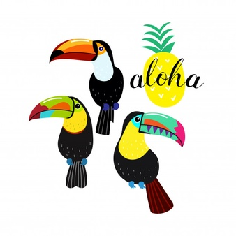
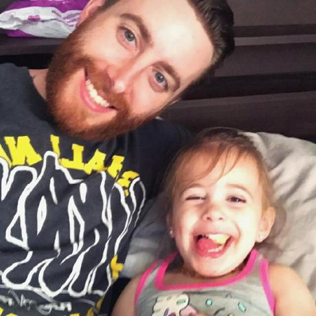
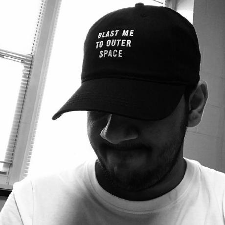

# Toucans-Team-06 Voyage-7

  

## Introduction

Welcome Ladies and Gentelmen to our learning project for the Chingu Cohort Voyage 7. For this Voyage we have decided to put our coding skills to the test by building a full-stack app from one of the Tier-2 Projects. The lucky project that we agreed to takle for this Voyage was is the Codemeets app.

Codemeets is an application for posting local coding meetups. The application will consist of various meetups located in both Rhode Island and the Sunshine state. Each listed meetup will include a brief description of the meetup, dates and times of meetings, location, and the contact person's information. 

## Links

The original web app can be found at: [Codemeets](https://codemeets.github.io/).

Our clone version can be found at: [Toucans-Team 6](https://github.com/chingu-voyage7/Toucans-Team-06).

* [Team Meetings](meetings.md)

## Documentation

The main stacks that were used to complete this project was React, Node.js, PostCSS

At the same time, we also decided to sprinkle in a few other things into the project to help make everything a bit more organized. The extra sprinkles that we used were: Gulp, BrowserSync and a few others.

## Team Members

The team consits of three highly motivated and skilled learners each with different sets of skills that they contributed to the completion of this project.

  

Project Manager &amp; Developer:[Jay Lee](https://github.com/dreampoetlee)

  
  
Developer: [Stephan](https://github.com/slamoureux)

  

Developer: [Gunasai](https://github.com/gunasai)

       

